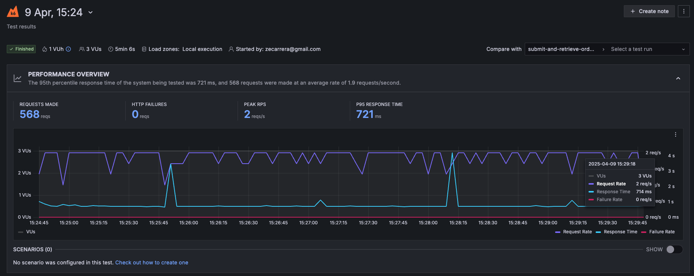
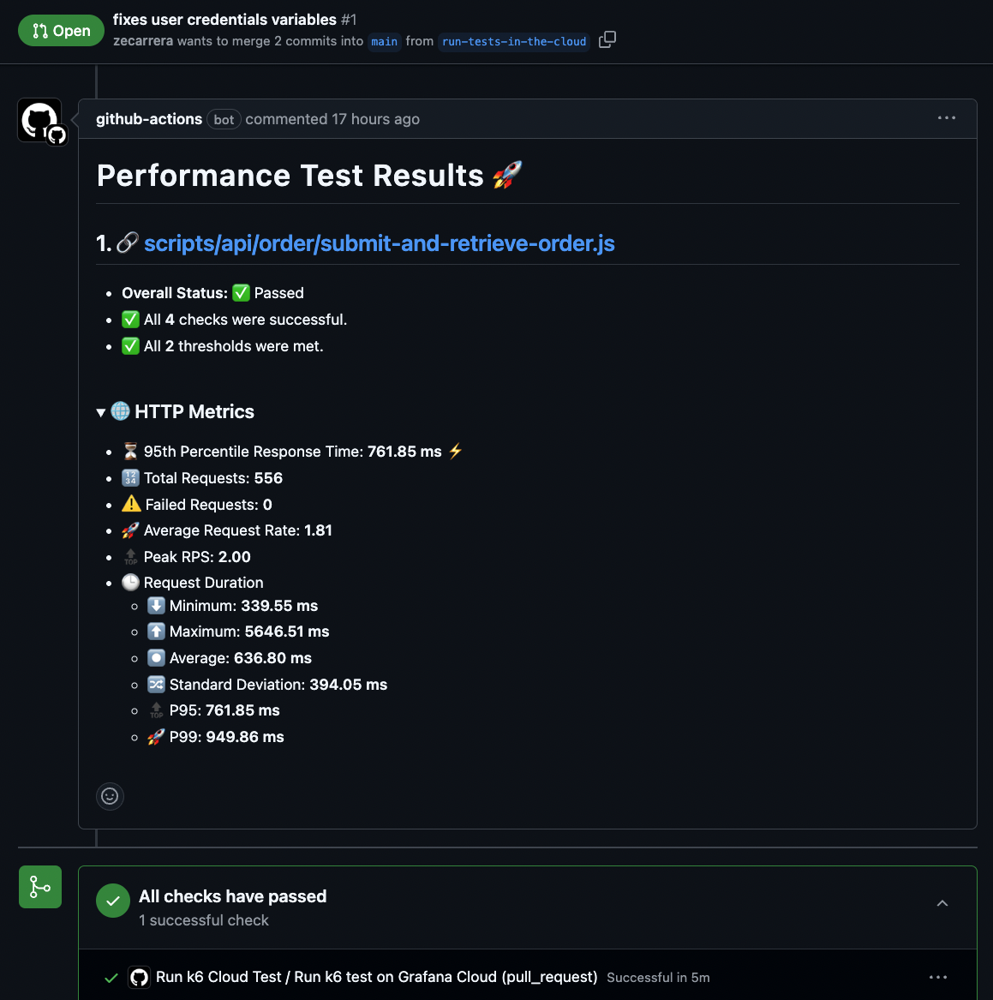

# performance-k6
PDT Performance testing framework using K6 and JavaScript


## Setup

Installing K6:
- macOS  
    `brew install k6`

Official documentation: [k6 installation](https://grafana.com/docs/k6/latest/set-up/install-k6/)

## Running tests 

### Locally

**Pre-requisites:**
- MERN-Shopping app is running - [Running mern app](https://github.com/zecarrera/mern-ecommerce/tree/mot?tab=readme-ov-file#running-locally-entire-application)
  
Smoke test:

```bash
k6 run \
  --iterations 10 \
  -e MY_HOSTNAME=http://localhost:9011/api \
  ./scripts/api/products/get-product-list.js
```

Specifying number of virtual users, iterations and duration:
```
  # Run 5 VUs, splitting 10 iterations between them.
  k6 run \
  --iterations 10 \
  --vus 5 \
  -e MY_HOSTNAME=http://localhost:9011/api \
  ./scripts/api/products/get-product-list.js

  # Run 5 VUs for 10s.
  k6 run \
  --vus 5 \
  --duration 10s \
  -e MY_HOSTNAME=http://localhost:9011/api \
  ./scripts/api/products/get-product-list.js
```

#### Generating html test report

If you desire to generate an HTML report of your local test run, you can set the following environment variables:

```
K6_WEB_DASHBOARD=true 
K6_WEB_DASHBOARD_EXPORT=html-report.html
```

Example command:
```
K6_WEB_DASHBOARD=true \ 
K6_WEB_DASHBOARD_EXPORT=html-report.html \
k6 run \
--vus 5 \
--duration 30s \
-e MY_HOSTNAME=http://localhost:9011/api \
./scripts/api/products/get-product-list.js
```
 
### Pipeline

Smoke tests are running using GitHub Actions. Workflow is set to run:  
- Daily at 7AM
- On Pull requests
- Manually triggered

Tests are running against the deployed DEV instance of MERN Shop application and results are published to grafana cloud.



When running on pull request a comment is also added with the test results.  




## Application under test  
Tests are written against the [MERN-ecommerce](https://github.com/zecarrera/mern-ecommerce/tree/master)